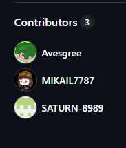
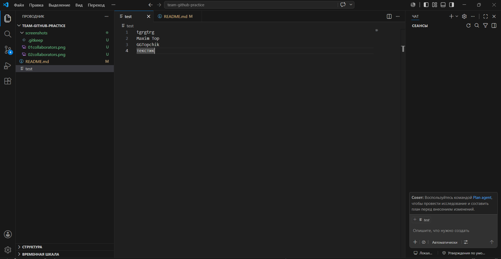
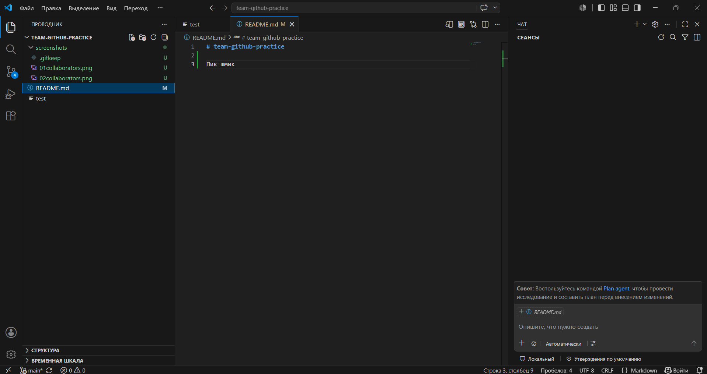
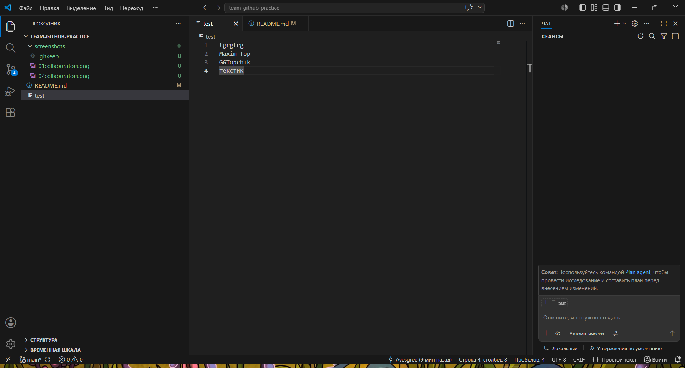
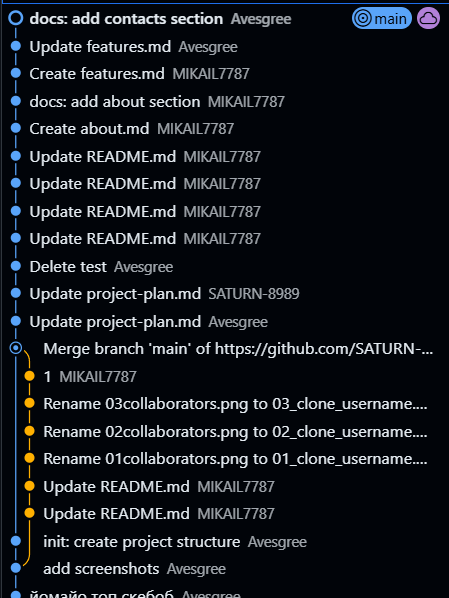

# team-github-practice
# Практическая работа: совместная разработка на GitHub
## Состав команды
| Участник | GitHub | Роль |
|---|---|---|
| Иваненко Данил | SATURN-8989 | Владелец репозитория |
| Петров Михаил | MIKAIL7787 | Разработчик |
| Авсеев Кирилл | Avesgree | Разработчик |
| Авсеев Кирилл | Avesgree | Проверяющий |

## Цель работы
Научиться работать в команде через GitHub.

## Описание
Это учебный командный проект для практики GitHub.

## Используемые инструменты
- Git;
- GitHub;
- VS Code.

## Проблема: забыли сделать Pull
Мы увидели, что если участник работает со старой версией проекта, Git может не
разрешить отправить изменения сразу. Сначала нужно получить актуальную версию
с GitHub, объединить изменения и только потом отправлять свои.

## Ход работы

### 1. Создание репозитория и добавление участников
Рисунок 1 — Добавление участников в репозиторий

### 2. Клонирование проекта всеми
участниками
Вставить описание и скриншоты участников.

### 3. Первый push
Вставить описание и скриншот.

### 4. Работа с изменениями других участников
Описать, кто какие файлы создал.

### 5. Ошибка при Push без Pull
Описать проблему и решение.

### 6. Merge conflict
Описать, как появился конфликт и как команда его решила.

### 7. Работа с ветками
Описать, какие ветки были созданы.

### 8. Pull Request
Описать, кто создал Pull Request и кто проверял.

### 9. Конфликт в Pull Request
Описать проблему и итоговое решение.

### 10. Fetch и Pull
Fetch позволяет увидеть, что на GitHub появились новые изменения, но не
применяет их сразу к локальным файлам. Pull получает изменения и сразу
объединяет их с текущей рабочей версией.

## История коммитов
Вставить скриншот истории коммитов.

## Вывод
Написать общий вывод команды:
- что получилось;
- какие проблемы возникли;
- что было самым сложным;
- зачем нужны ветки и Pull Request;
- почему важно делать Pull перед началом работы.

1) Репозиторий - это хранилище кода и истории его изменений.
2) Локальный - у вас на компьютере, удаленный - на сервере.
3) Pull - забирает изменения с удаленного репозитория и сразу сливает их с вашей текущей веткой.
4) Push - отправляет ваши локальные коммиты в удаленный репозиторий.
5) Fetch - только загружает изменения, а Pull = Fetch + слияние.
6) Ветка - это отдельная линия разработки, позволяющая вести работу изолированно.
7) Работать сразу в main неудобно, потому что там должен лежать стабильный код, а эксперименты и новые фичи могут его сломать.
8) Pull Request - это запрос на вливание изменений из одной ветки в другую с возможностью обсуждения.
9) Проверка PR нужна для поиска багов, улучшения качества кода и обмена знаниями в команде.
10) Merge conflict - ситуация, когда Git не может автоматически объединить изменения из-за правок в одних и тех же строках файла.
11) Конфликт возникает, когда две ветки изменяют одни и те же части файла по-разному.
12) При конфликте нужно вручную проанализировать оба варианта и выбрать нужный (или совместить их), затем убрать метки конфликта и сделать коммит.
13) Если забыть сделать Pull, при попытке Push появится ошибка, так как ваш локальный репозиторий устарел относительно удаленного.
14) Легче понять, что и зачем менялось.
15) _

## Статус проекта

Проект находится в активной разработке командой студентов. 
